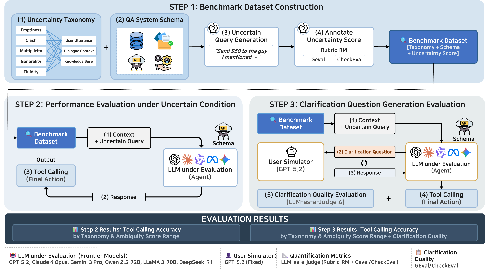

# UncertainQueryEval

카카오뱅크 AI 챗봇의 모호한 사용자 요청을 평가하기 위한 통합 프레임워크입니다. 이 저장소의 핵심 노트북인 `notebooks/ambiguity_eval_framework.ipynb`는 두 축을 결합합니다.

- 모호성 점수 산출: `CheckEval` 기반
- 멀티턴 명확화 및 API 선택 평가: `ConvCodeWorld` 스타일의 resolver-simulator 루프 기반

즉, 이 프로젝트는 "모호한 요청이 얼마나 모호한가"와 "명확화 대화를 거치면 실제 API 선택이 얼마나 좋아지는가"를 하나의 파이프라인에서 함께 측정합니다.



## Overview

프레임워크는 45개 카카오뱅크 모호성 시나리오를 대상으로 4단계 평가를 수행합니다.

| Stage | 내용 | 핵심 지표 |
|------|------|-----------|
| 1 | CheckEval 모호성 어노테이션 | `ambiguity_score` |
| 2 | 모호한 상태에서 직접 API 호출 | `endpoint_hit`, `slot_fill_accuracy` |
| 3a | 멀티턴 명확화 후 API 호출 | `endpoint_hit`, `slot_fill_accuracy`, `avg clarification turns` |
| 3b | 명확화 후 CheckEval 재측정 | `ambiguity_reduction` |
| 4 | 종합 비교 분석 | 상관관계, taxonomy별 개선 효과 |

점수 방향은 다음과 같습니다.

- `ambiguity_score = 1 - clarity_score`
- `0`에 가까울수록 명확
- `1`에 가까울수록 모호
- API 평가는 endpoint 선택 정확도와 slot filling 정확도를 분리해 봅니다.

## What Is Based On What

### 1. CheckEval 기반 모호성 평가

모호성 평가는 `src/evaluate_ambiguity_checkeval.py`와 `prompt/ambiguity_questions/`의 체크리스트를 사용합니다.  
각 시나리오는 taxonomy에 맞는 차원만 선택해 Yes/No 질문들로 분해 평가되고, 평균 clarity에서 역산해 `ambiguity_score`를 얻습니다.

사용하는 8개 평가 차원은 아래와 같습니다.

| 차원 | 대응 taxonomy |
|------|---------------|
| `information_sufficiency` | Emptiness |
| `information_coherence` | Clash |
| `interpretation_singularity` | Multiplicity |
| `request_specificity` | Generality |
| `temporal_determinacy` | Fluidity |
| `utterance_completeness` | User Utterance |
| `context_determinacy` | Dialogue Context |
| `kb_alignment` | Knowledge Base |

### 2. ConvCodeWorld 기반 멀티턴 명확화

Stage 3은 `ambiguity_eval_framework.ipynb` 내부의 멀티턴 루프를 사용합니다.

- `AmbiguityResolver`: 현재 대화와 API 명세를 보고 명확화 질문 또는 API 호출을 결정
- `UserSimulator`: 목표 API 방향에 맞춰 답변을 생성
- 최대 `MAX_CLARIFICATION_TURNS`까지 반복 후 최종 API 선택 평가

이 구성은 ConvCodeWorld 계열의 멀티턴 명확화 평가 방식과 유사하게, "질문-응답을 통해 점진적으로 의도를 분해한 뒤 최종 행동을 평가"하는 구조입니다.

## Dataset

평가 데이터는 `data/ambigous_query/ambiguity_scenarios.json`에 있습니다.

- 총 45개 시나리오
- `5 modalities × 3 elements × 3 scenarios`
- 서비스: `AI_CALCULATOR`, `AI_GROUP_TREASURER`, `AI_TRANSFER`

### Modalities

| Modality | 의미 |
|----------|------|
| Emptiness | 필수 정보 누락 |
| Clash | 정보 충돌 |
| Multiplicity | 복수 해석 가능 |
| Generality | 지나치게 포괄적 |
| Fluidity | 시간/조건에 따라 의미가 달라짐 |

### Elements

| Element | 의미 |
|---------|------|
| User Utterance | 발화 자체의 모호성 |
| Dialogue Context | 이전 대화 맥락에서 생기는 모호성 |
| Knowledge Base | API/도메인 지식과의 정렬 문제 |

## Repository Layout

```text
UncertainQueryEval/
├── notebooks/
│   ├── ambiguity_eval_framework.ipynb
│   ├── demo_ambiguity_checkeval.ipynb
│   └── kakaobank_ambiguity_eval.ipynb
├── src/
│   ├── evaluate_ambiguity_checkeval.py
│   ├── compare_ambiguity_runs.py
│   ├── generate_checklists.py
│   ├── inference_checkeval.py
│   ├── inference_geval.py
│   ├── aggregation.py
│   └── correlation.py
├── data/
│   └── ambigous_query/
├── prompt/
│   ├── ambiguity_questions/
│   └── ambiguity_questions_v1/
├── results/
│   ├── ambiguity_checkeval/
│   └── ambiguity_framework/
└── tests/
```

## Installation

```bash
pip install -r requirements.txt
pip install python-dotenv jupyterlab
```

노트북은 OpenAI API 키를 사용합니다. 아래 위치 중 하나의 `.env`를 자동으로 탐색합니다.

- `UncertainQueryEval/.env`
- 상위 디렉터리의 `.env`
- `~/convcodeworld/.env`

예시:

```bash
export OPENAI_API_KEY="sk-..."
```

## Main Notebook

메인 진입점은 `notebooks/ambiguity_eval_framework.ipynb`입니다.

```bash
cd UncertainQueryEval
jupyter lab notebooks/ambiguity_eval_framework.ipynb
```

노트북 기본 설정값:

- `MODEL = "gpt-5.4"`
- `QUESTION_VERSION = "filtered"`
- `MAX_CLARIFICATION_TURNS = 10`
- `MAX_CONCURRENCY = 8`

## Pipeline Details

### Stage 1. CheckEval 모호성 어노테이션

- 입력: `ambiguity_scenarios.json`
- 출력: `ambiguity_scenarios_annotated.json`
- 방식: taxonomy에 맞는 차원만 선택해 Yes/No 체크리스트 평가

산출 예시:

```json
{
  "ambiguity_score": 0.42,
  "clarity_score": 0.58,
  "dimension_ambiguity_scores": {
    "information_sufficiency": 0.50,
    "utterance_completeness": 0.33
  }
}
```

### Stage 2. Baseline 직접 API 호출

명확화 없이 모호한 요청 그대로 API를 선택하게 합니다.

- 성공 기준: 예측한 `api_id + endpoint`가 `gold_api.candidate_apis` 중 하나와 정확히 일치
- 출력 파일: `results/ambiguity_framework/baseline_<model>.jsonl`

주요 지표:

- `endpoint_hit`: gold endpoint를 정확히 맞췄는지
- `slot_fill_accuracy`: 맞춘 endpoint 기준으로 gold concrete slot을 얼마나 정확히 채웠는지

### Stage 3a. 멀티턴 명확화 후 API 호출

Resolver가 질문하고 Simulator가 답하는 멀티턴 루프를 수행한 뒤 최종 API를 평가합니다.

- 출력 파일: `results/ambiguity_framework/multiturn_<model>.jsonl`
- 핵심 지표:
  - `endpoint_hit`
  - `slot_fill_accuracy`
  - `num_clarification_turns`

평가는 턴별 `Recall@k`가 아니라 종료 시점 최종 호출 기준입니다.

### Stage 3b. 명확화 후 CheckEval 재측정

멀티턴 상호작용이 끝난 뒤의 최종 대화 상태를 다시 CheckEval에 넣어 모호성이 실제로 줄었는지 봅니다.

- 출력 파일: `results/ambiguity_framework/post_checkeval_<model>.json`
- 첫 턴에 이미 정확한 endpoint와 완전한 slot filling까지 끝낸 케이스만 스킵
- 핵심 지표: `pre_ambiguity - post_ambiguity`

### Stage 4. 종합 분석

모든 결과를 합쳐 taxonomy별 히트맵과 상관관계를 계산합니다.

- 출력 파일: `results/ambiguity_framework/framework_results_<model>.json`

## Existing Result Snapshot

현재 문서에는 `gpt-5.4` 실행 결과를 예시로 포함합니다.

### `gpt-5.4`

- Stage 1 평균 모호성: `0.5539`
- Stage 2 baseline endpoint hit: `0.6222`
- Stage 2 baseline slot accuracy: `0.4019`
- Stage 3 endpoint hit: `0.7556`
- Stage 3 slot accuracy: `0.5659`
- Stage 3 avg clarification turns: `1.4667`
- Stage 3b post ambiguity: `0.4288`
- 평균 모호성 감소: `0.1195`

해석 기준은 단순합니다.

- `pre_ambiguity`가 높을수록 baseline endpoint/slot 성능이 낮아지면 CheckEval 신호가 유효
- Stage 2보다 Stage 3a의 endpoint hit / slot accuracy가 높으면 명확화 대화가 실제로 도움이 됨
- `ambiguity_reduction > 0`이면 명확화가 모호성 자체를 줄였다고 볼 수 있음

노트북에는 추가로 다음 진단이 들어 있습니다.

- taxonomy별 `Pre-Ambiguity`, `Post-Ambiguity`, `Ambiguity Reduction` heatmap
- baseline 대비 multi-turn 성능이 오히려 나빠진 사례 목록

## CLI Utilities

### 모호성 체크리스트 생성

```bash
python src/generate_checklists.py \
  --seed_input ./prompt/ambiguity_questions \
  --output_dir ./prompt/ambiguity_questions \
  --benchmark_name ambiguity \
  --backend openai \
  --model gpt-4o
```

### CheckEval 모호성 평가 실행

```bash
python src/evaluate_ambiguity_checkeval.py \
  --data_path ./data/ambigous_query/ambiguity_scenarios.json \
  --question_dir ./prompt/ambiguity_questions \
  --question_version filtered \
  --mode matched \
  --backend openai \
  --model gpt-4o \
  --save_dir ./results/ambiguity_checkeval \
  --run_name run_v1
```

`--mode` 옵션:

- `matched`: taxonomy에 대응하는 차원만 평가
- `all`: 8개 차원 전체 평가
- `both`: 두 방식 모두 저장

### 실행 결과 비교

```bash
python src/compare_ambiguity_runs.py \
  --run_a ./results/ambiguity_checkeval/run_v1 \
  --run_b ./results/ambiguity_checkeval/run_v2 \
  --output_name v1_vs_v2
```

## Notes

- 이 저장소에는 원 논문용 CheckEval 트랙(`SummEval`, `TopicalChat`) 관련 코드도 포함되어 있습니다.
- 하지만 카카오뱅크 모호성 평가의 메인 워크플로는 `notebooks/ambiguity_eval_framework.ipynb` 기준으로 이해하는 것이 가장 정확합니다.
- 문서 기준으로는 "모호성 점수는 CheckEval 기반, 멀티턴 명확화는 ConvCodeWorld 기반"으로 이해하면 됩니다.
